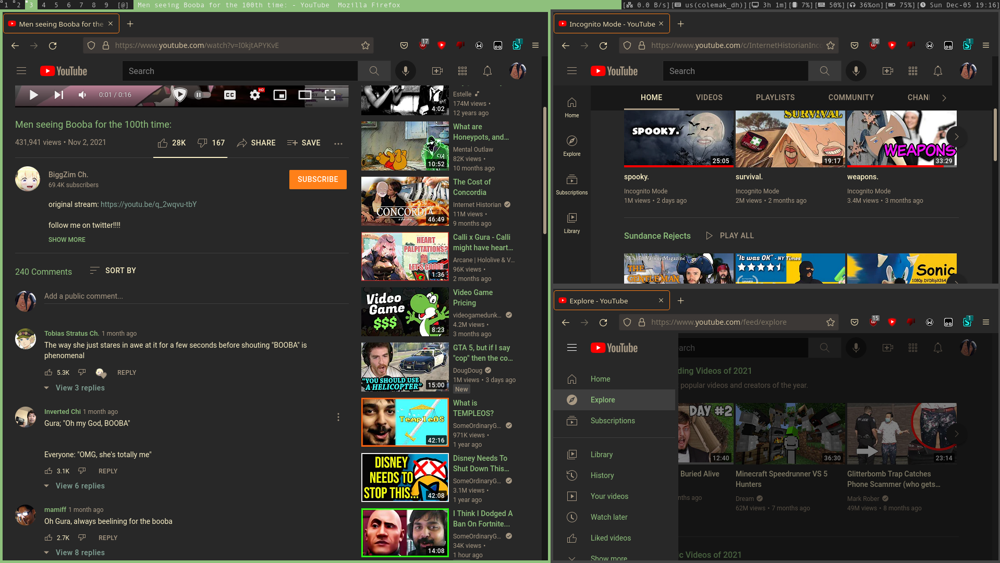

Oh so easy on the eyes. All based on the colors from the almighty [GruvBox](https://github.com/morhetz/gruvbox)

Get [Stylus](https://duckduckgo.com/?q=stylus+browser+extension) or anything then make a script from that, or not...

Stylus will try to parse the [raw fille](https://github.com/khanghugo/userstyles/raw/master/gruvbox-youtube.user.styl) and ask for you to install it so everything is davai.

 the code is stiffer than kristen steward acting so no flexibility here
